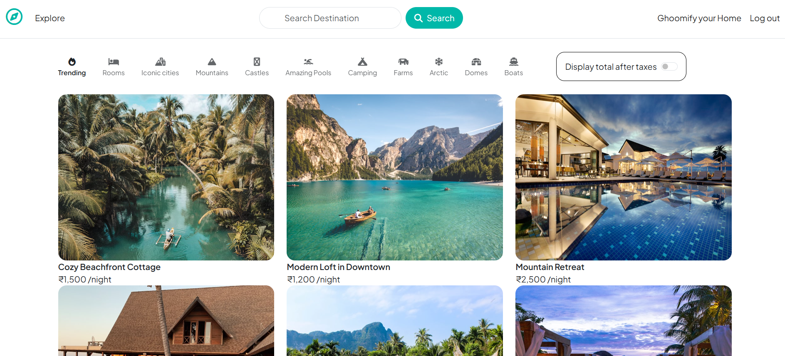

# Ghoomify 🌍

Welcome to **Ghoomify** – A platform to explore and list travel destinations! 🚀

## 📌 Features
- 🏝️ **Browse Listings** – Discover various travel destinations.
- ⭐ **Add Reviews & Ratings** – Share your experiences.
- 🔐 **User Authentication** – Secure login & signup with Passport.js.
- 🖼️ **Image Uploads** – Upload images using Cloudinary.


## 🛠️ Tech Stack
- **Frontend**: HTML, CSS, EJS (Embedded JavaScript)
- **Backend**: Node.js, Express.js
- **Database**: MongoDB with Mongoose
- **Authentication**: Passport.js
- **Storage**: Cloudinary for image uploads


## 📸 Preview



## 🚀 Getting Started
### 1️⃣ Clone the Repository:
```sh
git clone https://github.com/prajwalghurde/Ghoomify.git
```

### 2️⃣ Navigate to the Project Directory:
```sh
cd Ghoomify
```

### 3️⃣ Install Dependencies:
```sh
npm install
```

### 4️⃣ Set Up Environment Variables:
Create a **.env** file in the root directory and add:
```sh
ATLASDB_URL=your_mongodb_connection_string
CLOUDINARY_CLOUD_NAME=your_cloudinary_name
CLOUDINARY_API_KEY=your_cloudinary_api_key
CLOUDINARY_API_SECRET=your_cloudinary_api_secret
SECRET=your_session_secret
MAPBOX_TOKEN=your_mapbox_access_token
```

### 5️⃣ Start the Server:
```sh
npm start
```
Then open **`http://localhost:8080`** in your browser.

## 🌟 Live Demo
Check out the deployed version here:
🔗 [Ghoomify](https://ghoomify.onrender.com)

## 🤝 Contributing
We welcome contributions! Feel free to submit issues and pull requests.

## 📜 License
This project is licensed under the **MIT License**.

---

Happy Coding! 🚀🔥

